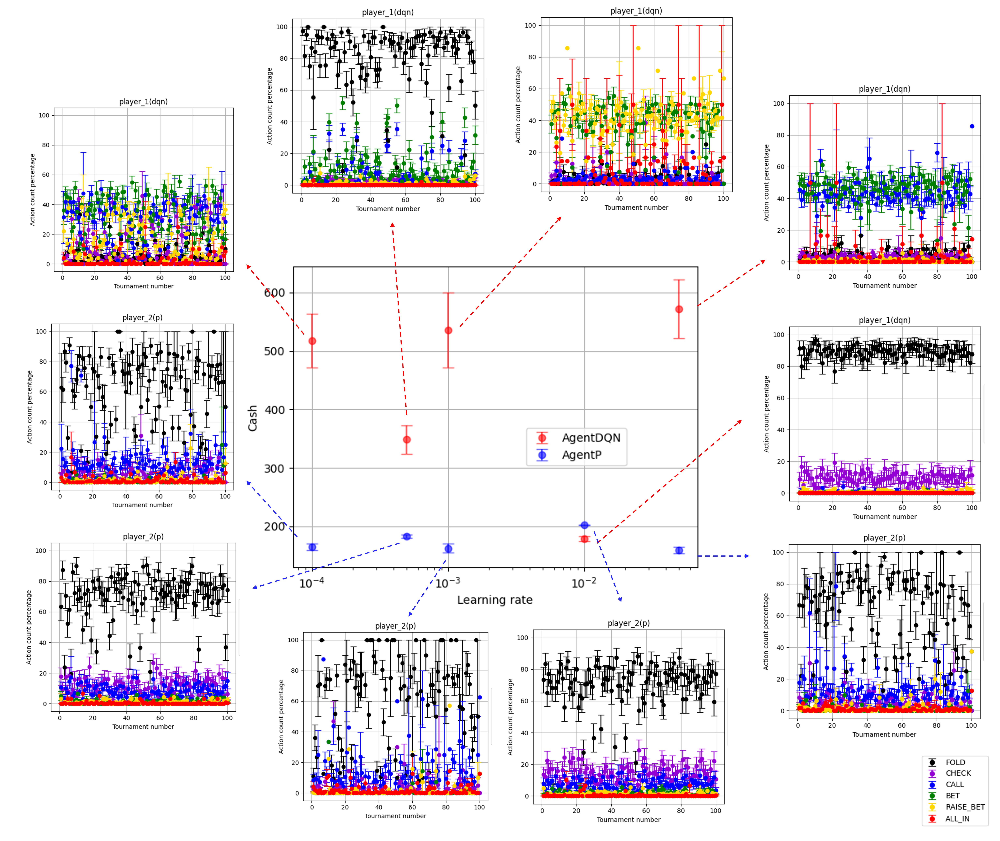

This repository contains experimental scripts and data for researching open-world learning infrastructure. We use the gym-open-poker environment for our experiments. For more details, visit https://github.com/minhsueh/gym-open-poker.




To execite files in `test` including DQN training, testing, and visulization 


1. Clone the repository:
```
git clone https://github.com/minhsueh/open-world-expt.git
```
2. Navigate to the project directory:
```
cd gym_open_poker
```
3. Create virtual environment 
```
python3 -m venv .env
source .env/bin/activate
```
4. Install the package in editable mode:
```
pip3 install -e .
```
5. Install additional dependencies:
```
pip3 install -r requirements.txt
```


